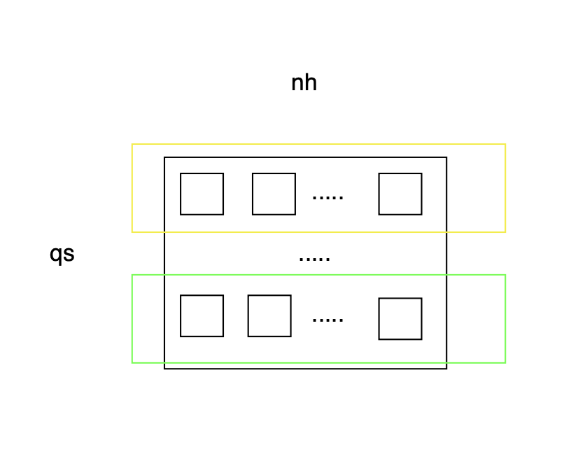
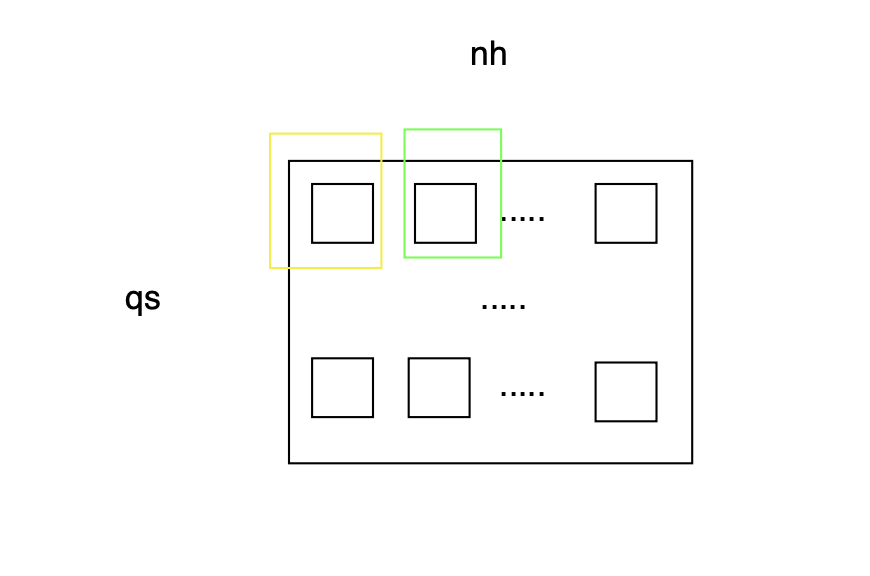
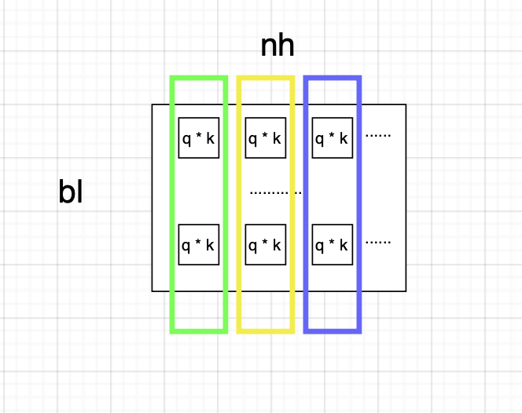
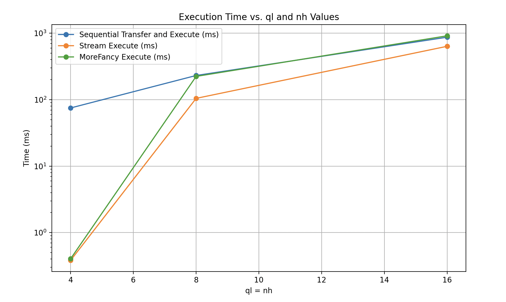
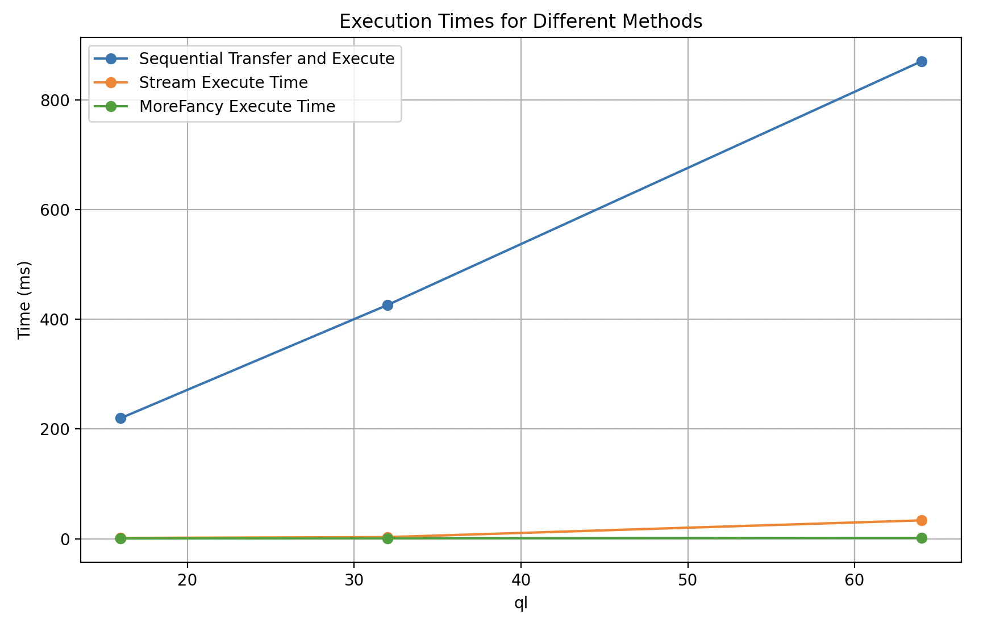
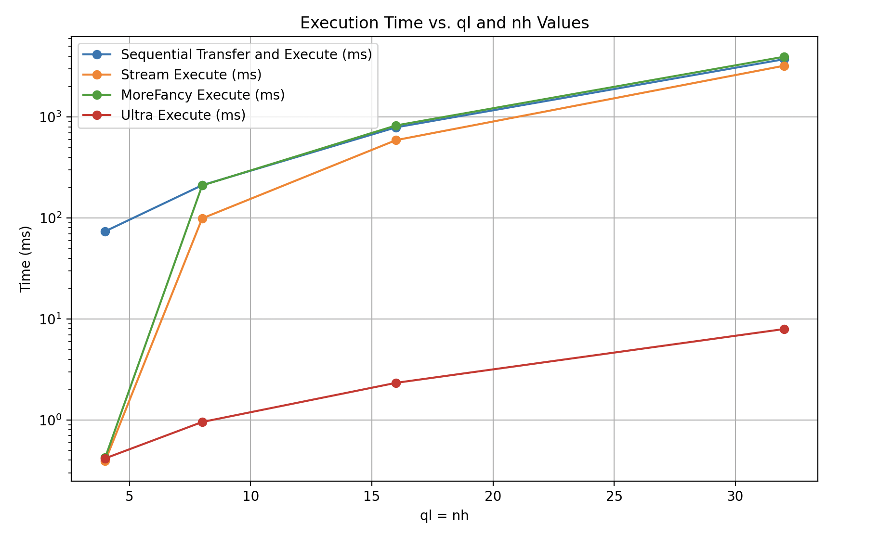

## 概述

查找过程的工作如下：

1. **将数据从 q 和 k 复制到 GPU（HtoD）**：将数据从Host传输到 Device.
2. **在内核中执行笛卡尔积、编码和存储**：在内核中执行笛卡尔积、编码、查找 LUT 和存储结果。
3. **将数据复制到存储（DtoH）**：将计算结果从 Device 传回Host。

## Basic版本

- **块启动**：我可以启动任意数量的block，总块数为 `qn * nh`。 （我们必须尽可能多地分配线程和块数。否则，瓶颈将由线程数量少造成）。
- **线程限制**：由于最多可以启动 1024 个线程，使用了一个 for 循环来处理 `qlen * klen > 1024` 的情况。循环如下：`for i = qlen * klen ; j > 1024 ; j -= 1024`。（见第 145 行）

### 优势

- **Grid大小**：grid大小较大。使用 Nsight 进行分析显示内存和计算吞吐量是平衡的。

## Stream方法

Stream方法涉及将数据分成与stream数相对应的相等部分。以下是最简单的思路。

或者

### 缺点

- **Grid大小**：grid大小往往较小。（不过我可以改变它）
- **重复复制 LUT**：我只需复制 `nh * k * K`。目前，我复制的是 `ql * nh * K * K`。（不过我可以改变它）

## FancyAllocation

另一个尝试的方法是复杂分配，其中一个stream负责一列。

不同颜色表示不同的stream。每个stream仅复制一个 LUT，而不是 `nh * LUT`。

### 缺点

- **grad大小**：和之前一样
- **不健康的访问模式**：我们在查询、键和存储之间跳跃访问。

## 实验

当 `q = 256 ; k = 256 ; K = 64` （抱歉，这是我的 GPU 能承受的最大值）。

让我们改变 `ql` 和 `nh`：

stream方法中的stream数量为 4（最佳值）。每个stream的最大工作负载是每次 `nh`。

在这里，我可以确定地改变工作负载（块）。但是在这个版本中,我不知道为什么我限制工作负载小于 `nh`。

Fancy 方法中的stream数量等于 `nh`（为了仅复制 `nh * K * K`）。所以这里的stream数量被限制为 `bn`。最大工作负载应小于 `bh`。

**Results:**

`ql = 4 ; nh = 4`

- Time for sequential transfer and execute (ms): 75.158401
- Time for stream execute (ms): 0.382784
- Time for MoreFancy execute (ms): 0.404832

`ql = 8 ; nh = 8`

- Time for sequential transfer and execute (ms): 231.537628
- Time for stream execute (ms): 104.765282
- Time for MoreFancy execute (ms): 224.317978

`ql = 16 ; nh = 16`

- Time for sequential transfer and execute (ms): 872.630005  
- Time for stream execute (ms): 636.395386  
- Time for MoreFancy execute (ms): 915.603516   

但如果我们将 `nh` 限制为 4 并增加 `qh`：

`ql = 16 ; nh = 4`

- Time for sequential transfer and execute (ms): 219.953598  
- Time for stream execute (ms): 1.393504  
- Time for MoreFancy execute (ms): 0.532352  

`ql = 32 ; nh = 4`

- Time for sequential transfer and execute (ms): 426.429443  
- Time for stream execute (ms): 2.900448  
- Time for MoreFancy execute (ms): 0.839200  

`ql = 64 ; nh = 4`

- Time for sequential transfer and execute (ms): 870.881531  
- Time for stream execute (ms): 33.405376
- Time for MoreFancy execute (ms): 1.307680

所以我们知道：
1. stream的数量应该是 4(最佳)。
2. grid大小（工作负载）应该足够大!!!!
3. 在第二次实验中，方法 2 和方法 3 之间的差异要么是由于重复复制 LUT，要么是grid大小造成的。

首先，我尝试解决问题 2。如前所述，我可以调整以消除重复复制。我也可以消除工作负载约束。

现在这是我的终极版本：工作负载可以是 `bl * nh` factor，而不是 `nh` 或 `bl`的factor，并且没有重复复制。

**Results:**

`ql = 4 ; nh = 4`

- Time for sequential transfer and execute (ms): 73.896317  
- Time for stream execute (ms): 0.393440  
- Time for MoreFancy execute (ms): 0.424800  
- Time for Ultra execute (ms): 0.417376  

`ql = 8 ; nh = 8`

- Time for sequential transfer and execute (ms): 211.430496  
- Time for stream execute (ms): 99.160835  
- Time for MoreFancy execute (ms): 210.150589  
- Time for Ultra execute (ms): 0.956000  

`ql = 16 ; nh = 16`

- Time for sequential transfer and execute (ms): 790.458130  
- Time for stream execute (ms): 590.692383  
- Time for MoreFancy execute (ms): 825.458679  
- Time for Ultra execute (ms): 2.335008  

`ql = 32 ; nh = 32`

- Time for sequential transfer and execute (ms): 3732.801758  
- Time for stream execute (ms): 3217.209229  
- Time for MoreFancy execute (ms): 3949.333740  
- Time for Ultra execute (ms): 7.954624    

我没有上加ql,nh，因为我的 GPU 就这么糟糕。
